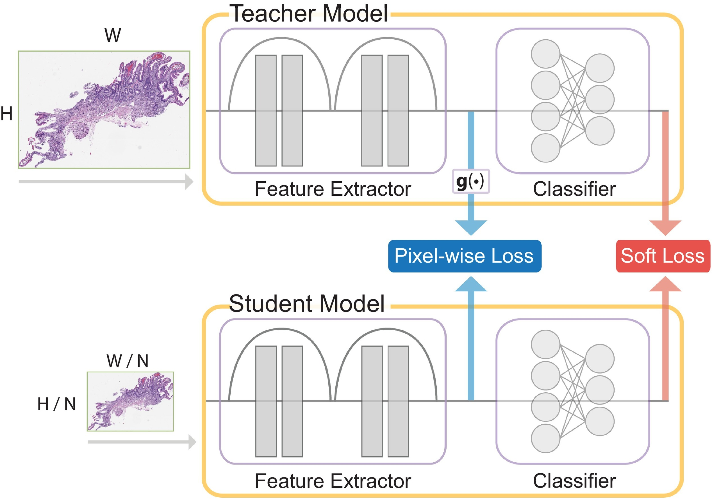

# ResolutionDistillation
Official code for the paper [Resolution-based distillation for efficient histology image classification](https://doi.org/10.1016/j.artmed.2021.102136) appearing in the Elsevier Journal of Artificial Intelligence in Medicine.



# Requirements
+ [matplotlib](https://matplotlib.org/)
+ [numpy](https://numpy.org/)
+ [pandas](https://pandas.pydata.org/)
+ [pillow](https://pillow.readthedocs.io/en/stable/#)
+ [scikit-learn](https://scikit-learn.org/stable/)
+ [scipy](https://scipy.org/)
+ [seaborn](https://seaborn.pydata.org/)
+ [torch](https://pytorch.org/)
+ [torchvision](https://docs.pytorch.org/vision/stable/index.html)
+ [tqdm](https://tqdm.github.io/)
+ [tvmi](https://github.com/jdipalma2/torchvision-multi-image)
+ [wandb](https://wandb.ai/site/)

# Installing Dependencies (Recommended)
Run 
```commandline
pip install -r requirements.txt
```
to install all the required packages. Depending on your system configuration, you may need to install different versions to the ones we provide.

# Usage
The file `config.py` contains all the configurable options for the model. 
You can either change the options in this file (not recommended) or on the command line when running the model.

To run the model, use
```commandline
python main.py
```
and add any command line arguments as desired.

# To-do
+ Add documentation to remaining files
+ Add usage details to README
+ Add versions to requirements.txt
+ Refactor anything else needed
+ Add W&B support
+ Re-write evaluation code
+ ...